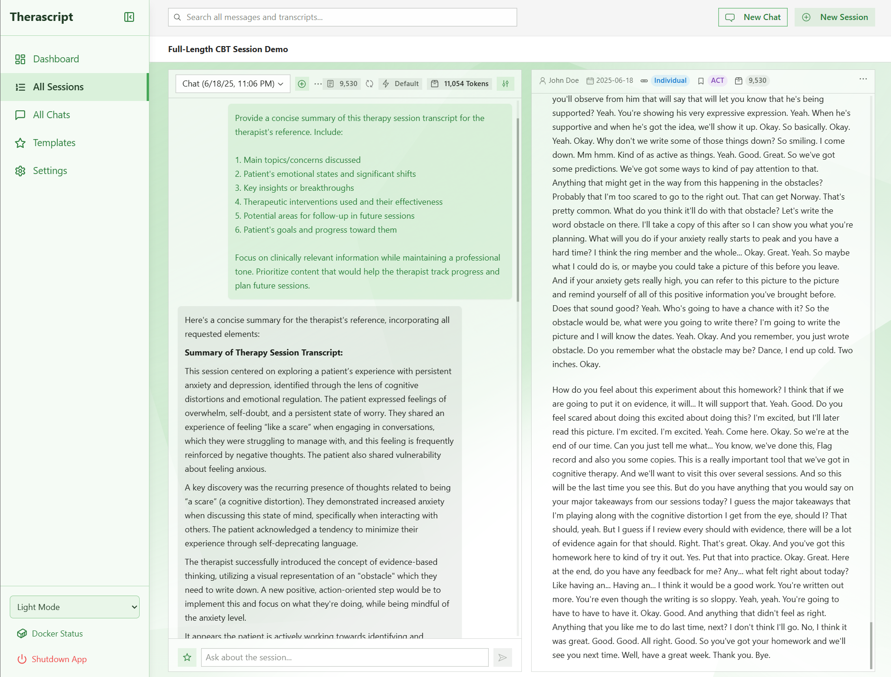

# Therascript ✨

Therascript is a comprehensive application designed to assist therapists by streamlining the process of analyzing therapy sessions. It allows users to upload audio recordings of sessions, which are then transcribed and made available for AI-powered chat analysis. This enables therapists to quickly gain insights, review key moments, and efficiently manage their session notes.



## Key Features

*   **Session Management:** Upload audio files, manage session metadata (client details, date, type, therapy modality), and view a history of all sessions.
*   **Audio Transcription:** Utilizes OpenAI's Whisper model (via a dedicated Docker service) to accurately transcribe session audio.
*   **AI-Powered Chat Analysis:**
    *   Interact with an AI (powered by local LLMs via Ollama) to ask questions about specific session transcripts.
    *   Engage in standalone AI chat sessions not tied to a specific therapy session.
    *   **Message Templates:** Save useful prompts as templates for quick reuse.
*   **Multi-Session Analysis:** Select multiple sessions and run a single high-level query across all of them. The system performs a MapReduce-style analysis to generate a synthesized answer.
*   **Full-Text Search:** Search across all chat messages and transcript paragraphs to quickly find relevant information using Elasticsearch.
*   **LLM Management:**
    *   View locally available Ollama models.
    *   Pull new models from the Ollama library.
    *   Set the active model and context size for analysis.
    *   Delete locally stored models.
    *   Unload models from memory to free up resources.
*   **System Monitoring:**
    *   **GPU Monitoring:** A sidebar indicator shows real-time GPU and VRAM utilization. A detailed modal provides in-depth statistics for NVIDIA GPUs, including temperature, power draw, and per-process VRAM usage.
    *   **Background Job Monitoring:** View the status of active background jobs (transcription and analysis) in a queue modal.
*   **Advanced Data Management:**
    *   **Export/Import:** Create a full backup of the database and uploaded files as a `.tar` archive, and restore from it.
    *   **Re-index:** Rebuild the Elasticsearch search index from the database.
    *   **Full Reset:** A "danger zone" function to wipe all application data.
*   **User Interface:** A modern, responsive web UI built with React and Radix UI Themes for intuitive interaction.
*   **Dockerized Services:** Ollama, Whisper, Elasticsearch, and Redis are containerized for easy setup and management.
*   **Customizable Experience:** Includes theme selection (light, dark, system), customizable UI accent color, and options for rendering AI responses (Markdown or plain text).

## Technology Stack

*   **Frontend:**
    *   React 19, TypeScript
    *   Radix UI Themes & Primitives
    *   Tailwind CSS
    *   Tanstack Query (Server State Management)
    *   Jotai (UI State Management)
    *   React Router DOM (Routing)
    *   Webpack (Build Tool)
    *   Axios (API Client)
    *   Lucide React (Icons)
*   **Backend (API & Worker):**
    *   ElysiaJS (Node.js Framework)
    *   TypeScript
    *   SQLite (via `better-sqlite3`)
    *   **BullMQ & Redis:** For background job queuing.
    *   `@dqbd/tiktoken` (Token counting)
*   **AI Services:**
    *   **Ollama:** For running local Large Language Models (LLMs).
    *   **Whisper (OpenAI):** For audio transcription (via a Python FastAPI service).
*   **Search Service:** Elasticsearch
*   **Database:** SQLite
*   **Containerization:** Docker, Docker Compose
*   **Monorepo Management:** Lerna, Yarn Workspaces

## Project Structure

Therascript is a monorepo organized into several packages:

*   `packages/api`: The backend ElysiaJS server. Handles business logic, database interactions, and communication with other services.
*   `packages/worker`: A separate Node.js process that consumes jobs from the Redis queue (e.g., transcription, analysis).
*   `packages/ui`: The React-based frontend application that users interact with.
*   `packages/ollama`: Contains Docker configuration and management scripts for the Ollama service.
*   `packages/whisper`: Contains the Python service for Whisper, its Dockerfile, and management scripts.
*   `packages/gpu-utils`: A shared utility for querying NVIDIA GPU stats via `nvidia-smi`.
*   `packages/elasticsearch-client`: A shared client for interacting with Elasticsearch.
*   `packages/docker-utils`: Shared utilities for managing Docker containers.
*   `scripts/`: Root-level scripts for running the application in different modes (e.g., `run-dev.js`).

## Further documentation

- TL;DR for Copilot: COPILOT.md
- Architecture overview: docs/ARCHITECTURE.md
- Navigation cheatsheet (where to change what): docs/NAVIGATION.md

## Prerequisites

Before you begin, ensure you have the following installed:

1.  **Node.js and Yarn:**
    *   It's recommended to use NVM (Node Version Manager). The required Node.js version is in `.nvmrc`.
        ```bash
        nvm install
        nvm use
        ```
    *   Yarn (Classic v1.x) is used as the package manager.
2.  **Docker and Docker Compose:**
    *   Docker Desktop for Windows/macOS or Docker Engine + Docker Compose plugin for Linux.
    *   Ensure the Docker daemon is running.
3.  **Configure Docker to use NVIDIA runtime**
        ```bash
        sudo nvidia-ctk runtime configure --runtime=docker
        sudo systemctl restart docker
        ```
4.  **NVIDIA GPU with CUDA (Recommended for AI Services):**
    *   For optimal performance, an NVIDIA GPU with CUDA drivers and the [NVIDIA Container Toolkit](https://docs.nvidia.com/datacenter/cloud-native/container-toolkit/latest/install-guide.html) is highly recommended. The GPU monitoring feature specifically requires `nvidia-smi` to be available on the host.
    *   Ollama and Whisper *can* run on CPU, but performance will be significantly slower.

## Setup and Installation

1.  **Install Node.js Version:**
    ```bash
    nvm use
    ```

2.  **Install Dependencies:**
    ```bash
    yarn install
    ```

3.  **Configure Environment Variables:**
    *   Copy the example environment file `.env.example` to:
        *   `.env.api.dev` (for the API in development)
        *   `.env.worker.dev` (for the background worker in development)
        *   And optionally `.env.api.mock`, `.env.api.prod`.
    *   Adjust the variables as needed for your setup (e.g., `OLLAMA_MODEL`, `DB_PATH`).

4.  **Build All Packages:**
    This compiles TypeScript code for all packages.
    ```bash
    yarn build
    ```

## Running the Application

### Development Mode

This mode starts the API, the background worker, the UI (with hot-reloading), and service managers for dependent Docker containers. It uses settings from `.env.api.dev` and `.env.worker.dev`.

1.  **Start Docker Services:**
    The root `docker-compose.yml` manages the core background services. Start them first.
    ```bash
    # Run from the project root directory
    docker compose up -d --build
    ```
    This will start Whisper, Elasticsearch, and Redis. Kibana is also available for exploring search data.

2.  **Start the Development Environment:**
    The `yarn dev` script orchestrates all the Node.js processes and the Ollama Docker container.
    ```bash
    # Run from project root
    yarn dev
    ```
    This command will:
    *   Start the **API** server.
    *   Start the **UI** development server (usually at `http://localhost:3002`).
    *   Start the background **Worker** process.
    *   Ensure the **Whisper**, **Elasticsearch**, and **Ollama** Docker containers are running and healthy.

3.  **Access the Application:**
    Open your browser and navigate to `http://localhost:3002`.

### Mock Mode

For frontend development without running real AI/transcription services, you can use mock mode.

```bash
# Run from project root
yarn dev:mock
```
This starts the UI and a mocked version of the API, providing placeholder data and responses.

### Stopping the Application

*   Press `Ctrl+C` in the terminal where `yarn dev` is running. The shutdown script will attempt to gracefully stop all processes and Docker containers it manages.
*   To stop the services managed by the root `docker-compose.yml` (like Elasticsearch), run:
    ```bash
    docker compose down
    ```

## Testing

All unit tests are written with Vitest and focus on backend packages (no UI tests).

1. Ensure you're using the Node version from `.nvmrc` in any new terminal:
    ```bash
    nvm use
    ```
2. Run the test suite from the repo root:
    ```bash
    yarn test
    ```
3. Watch mode and coverage:
    ```bash
    yarn test:watch
    yarn coverage
    ```

Tests live alongside sources as `*.test.ts` under `packages/**/src/`.
